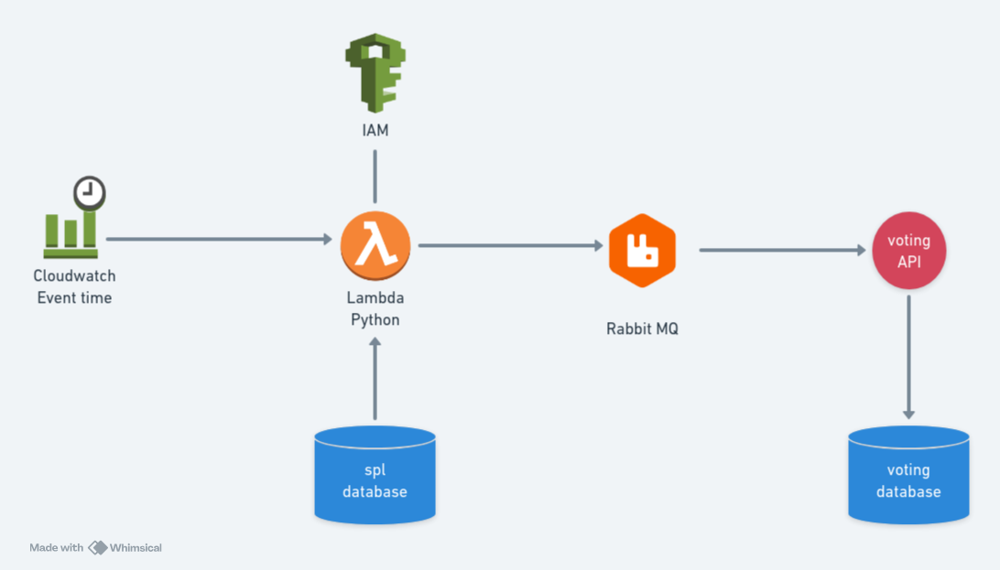

# POC - Pandas + RabbitMQ + AWS
This is a Proof of Concept that uses AWS services to read data from a PostgreSQL database and send it through a RabbitMQ queue.

# How it works ?
It creates a scheduled lambda funcion that runs every 5 minutes doing:
- Access Postgres database and reads data
- Transform data 
- Send data to RabbitMq in JSON format



# What you need to have installed
- Docker
- OpenTofu or Terraform
- Python (3.12)
- Poetry

# How to use it

## Running on LocalStack

Please follow the sequence below:

1. Start containers running:
```
docker compose up -d
```

2. Initializa OpenTofu:
```
cd terraform
tofu init
```

3. Plan it:
```
tofu plan
```

4. Apply it:
```
tofu apply
```

## Running locally without Localstack (testing the funcion)

1. Activate python environment:
```
poetry shell
```

2. Execute python function:
```
python lambda/handler.py
```